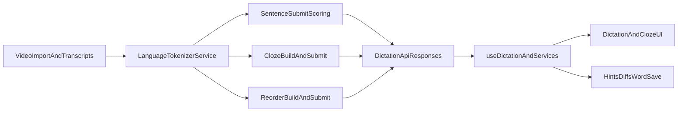

# Japanese Dictation Implementation Plan

## Goal
Implement reliable Japanese dictation by introducing language-aware morpheme tokenization across scoring, cloze/reorder generation, and UI feedback, while keeping current English behavior unchanged.

## Architecture Direction
- Keep existing `/dictation` endpoints and session flow.
- Add a shared backend tokenization/scoring layer keyed by language (`en` vs `ja`).
- Preserve current response shapes where possible; extend them in backward-compatible ways for token metadata.
- Update frontend dictation rendering/hints/word-save logic to consume token metadata instead of assuming whitespace words.

## Phase 1: Backend foundation (language-aware tokenization)
- Add a new service module (e.g. `app/services/tokenization_service.py`) with:
  - `tokenize_text(text: str, language: str) -> list[TokenUnit]`
  - `normalize_token(token: str, language: str) -> str`
  - `tokens_for_scoring(text, language)` and helpers for offsets/spans.
- Implement Japanese tokenizer path using morpheme segmentation (Sudachi/fugashi family), with deterministic normalization policy (NFKC + script-safe rules; no Latin-centric stripping that destroys Japanese distinctions).
- Keep English path functionally equivalent to current behavior.
- Add dependency + runtime docs in backend requirements/environment setup.

Primary files:
- [`/Users/macbook/Documents/backend/app/services/dictation_service.py`](/Users/macbook/Documents/backend/app/services/dictation_service.py)
- [`/Users/macbook/Documents/backend/app/services/cloze_service.py`](/Users/macbook/Documents/backend/app/services/cloze_service.py)
- [`/Users/macbook/Documents/backend/app/services/youtube_service.py`](/Users/macbook/Documents/backend/app/services/youtube_service.py)
- New: [`/Users/macbook/Documents/backend/app/services/tokenization_service.py`](/Users/macbook/Documents/backend/app/services/tokenization_service.py)

## Phase 2: Sentence dictation scoring + hints compatibility
- Refactor `compute_word_diff` to accept language and score by token units from tokenizer service.
- In submit and skip paths, stop using `split()`; use language tokenization from transcript/video language.
- Keep `word_diffs` contract but ensure each entry maps to a morpheme token for Japanese.
- Extend schema only if needed (optional token index/span fields) while keeping old clients functional.
- Maintain existing hint penalty behavior (`hints_used`) and session progress semantics.

Primary files:
- [`/Users/macbook/Documents/backend/app/api/v1/dictation.py`](/Users/macbook/Documents/backend/app/api/v1/dictation.py)
- [`/Users/macbook/Documents/backend/app/services/dictation_service.py`](/Users/macbook/Documents/backend/app/services/dictation_service.py)
- [`/Users/macbook/Documents/backend/app/schemas/dictation.py`](/Users/macbook/Documents/backend/app/schemas/dictation.py)
- [`/Users/macbook/Documents/backend/app/api/v1/rooms.py`](/Users/macbook/Documents/backend/app/api/v1/rooms.py)

## Phase 3: Cloze/reorder and transcript segmentation alignment
- Update cloze token generation/scoring to use language-aware tokens for blank selection and answer matching.
- Update reorder tokenization/scoring to language-aware units (not whitespace split + lowercase).
- Make transcript processing/segment limits language-aware so Japanese doesn’t break on ASCII-centric `WORD_RE` assumptions.
- Ensure `1d/7d/...` practice content remains stable and deterministic after tokenization changes.

Primary files:
- [`/Users/macbook/Documents/backend/app/services/cloze_service.py`](/Users/macbook/Documents/backend/app/services/cloze_service.py)
- [`/Users/macbook/Documents/backend/app/api/v1/dictation.py`](/Users/macbook/Documents/backend/app/api/v1/dictation.py)
- [`/Users/macbook/Documents/backend/app/services/youtube_service.py`](/Users/macbook/Documents/backend/app/services/youtube_service.py)
- [`/Users/macbook/Documents/backend/app/services/transcript_segmentation_service.py`](/Users/macbook/Documents/backend/app/services/transcript_segmentation_service.py)

## Phase 4: Language metadata and import safety
- Normalize and validate language handling (`ja`, optional region forms) across video import/update flows.
- Ensure transcript refresh uses video language preferences instead of hardcoded English defaults.
- Add admin-level ability (or safe migration script) to correct language metadata on existing videos if required.

Primary files:
- [`/Users/macbook/Documents/backend/app/models/video.py`](/Users/macbook/Documents/backend/app/models/video.py)
- [`/Users/macbook/Documents/backend/app/api/v1/videos.py`](/Users/macbook/Documents/backend/app/api/v1/videos.py)
- [`/Users/macbook/Documents/backend/app/api/v1/admin/videos.py`](/Users/macbook/Documents/backend/app/api/v1/admin/videos.py)
- [`/Users/macbook/Documents/backend/app/schemas/video.py`](/Users/macbook/Documents/backend/app/schemas/video.py)

## Phase 5: Frontend dictation UX updates (fullstack scope)
- Replace whitespace-based token assumptions with token-unit rendering in dictation feedback/hints.
- Update caret positioning to use token indices from backend diffs instead of `\S+` heuristics.
- Update cloze input feedback copy/UX from “letters/words” to language-neutral token terms where needed.
- Update word-save logic to avoid unconditional lowercasing; preserve Japanese tokens safely.
- Ensure auto-refresh of transcript segments and answer panels still performs well with larger token arrays.

Primary files:
- [`/Users/macbook/Documents/frontend/src/features/dictation/components/DictationPage.tsx`](/Users/macbook/Documents/frontend/src/features/dictation/components/DictationPage.tsx)
- [`/Users/macbook/Documents/frontend/src/features/dictation/components/WordSavePanel.tsx`](/Users/macbook/Documents/frontend/src/features/dictation/components/WordSavePanel.tsx)
- [`/Users/macbook/Documents/frontend/src/features/dictation/components/DottedHintBar.tsx`](/Users/macbook/Documents/frontend/src/features/dictation/components/DottedHintBar.tsx)
- [`/Users/macbook/Documents/frontend/src/features/dictation/components/FullClozeView.tsx`](/Users/macbook/Documents/frontend/src/features/dictation/components/FullClozeView.tsx)
- [`/Users/macbook/Documents/frontend/src/features/dictation/services/dictationService.ts`](/Users/macbook/Documents/frontend/src/features/dictation/services/dictationService.ts)
- [`/Users/macbook/Documents/frontend/src/shared/types/api.ts`](/Users/macbook/Documents/frontend/src/shared/types/api.ts)

## Phase 6: Testing, rollout, and safeguards
- Add backend unit tests for Japanese tokenization + scoring edge cases:
  - kana/kanji mixed input
  - punctuation variants and full-width characters
  - morpheme order and omission cases
- Add backend API tests for sentence submit, cloze-submit-all, reorder-submit in Japanese videos.
- Add frontend tests for rendering and caret/hint behavior with Japanese token diffs.
- Roll out behind a feature flag (e.g. `ENABLE_JA_DICTATION`) or language-gated branch to reduce regression risk.
- Validate no behavior change for English regression suite.

Primary files:
- [`/Users/macbook/Documents/backend/tests/test_dictation_service.py`](/Users/macbook/Documents/backend/tests/test_dictation_service.py)
- New API tests under [`/Users/macbook/Documents/backend/tests/`](/Users/macbook/Documents/backend/tests/)
- Frontend tests under [`/Users/macbook/Documents/frontend/src/features/dictation/`](/Users/macbook/Documents/frontend/src/features/dictation/)

## Non-goals for this iteration
- No switch to real-time streaming dictation evaluation.
- No redesign of overall session lifecycle or route structure.
- No broad i18n rewrite outside dictation-related surfaces.

## Success criteria
- Japanese videos can run sentence/cloze/reorder with morpheme-level scoring and coherent feedback.
- English dictation behavior and scores remain stable.
- Import + transcript refresh preserve correct Japanese language defaults.
- Frontend no longer relies on whitespace tokenization for dictation feedback paths.